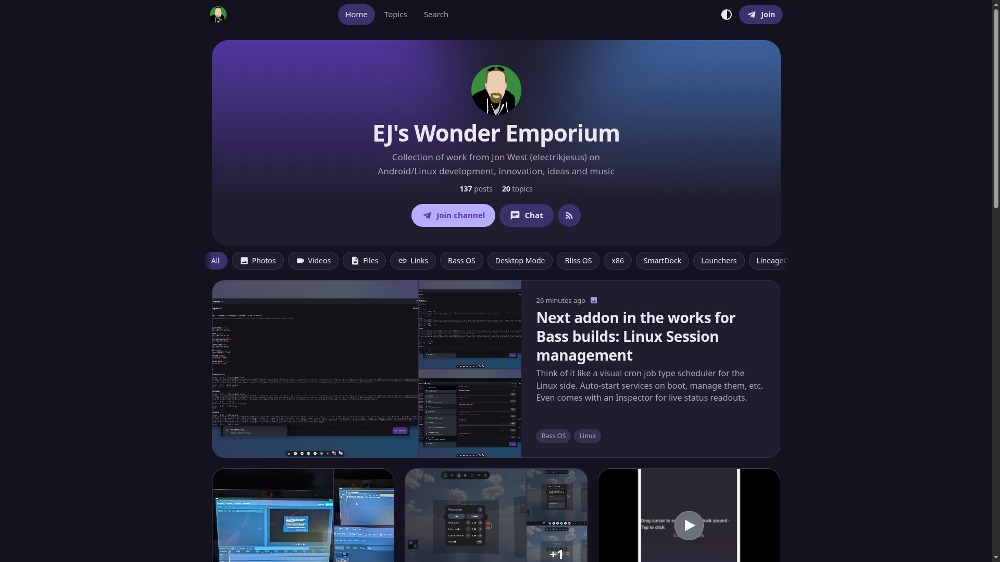
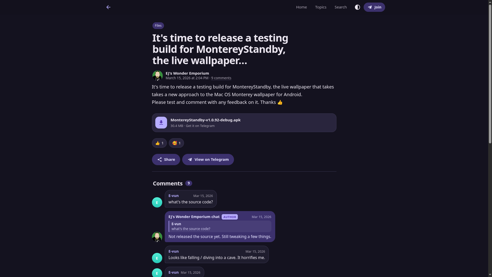

# EJ's Wonder Emporium — Telegram → blog

Everything posted to the public Telegram channel [@ejswonderemporium](https://t.me/ejswonderemporium) is turned into a blog post automatically, together with the comments from its chat [@ejswonder](https://t.me/ejswonder). Post once on Telegram and the site updates itself within the hour.

**Live site:** https://electrikjesus.github.io/EJsWonderEmporium/

<p align="center">
  
  
</p>

This repository is also a **template**: point one config file at your own channel and you get the same site for yours. No bot, API key or server is needed. It all runs on free GitHub Actions and GitHub Pages.

- [Features](#features)
- [Use it for your own channel](#use-it-for-your-own-channel)
- [Configuration](#configuration)
- [Branding](#branding)
- [How it works](#how-it-works)
- [Running it yourself](#running-it-yourself)
- [Troubleshooting](#troubleshooting)

## Features

- **Hands-off.** An hourly GitHub Actions job picks up new, edited and deleted posts, and new comments, then redeploys the site.
- **Whole history.** The first run imports every post the channel has ever published.
- **Real blog posts.** Several posts sent within a couple of minutes (say, text and then some photos) become one entry. A short first line becomes the title. Line breaks, `###` headings and `-`/`•` bullets become proper paragraphs, headings and lists.
- **Media kept safe.** Photos, video thumbnails and link-preview images are copied into the repository because Telegram's image links expire.
- **Videos play on the page, streamed from Telegram**, so no video files are stored in the repository. Black thumbnails are replaced with a real frame from the video. Videos too large for Telegram's web preview get a "Watch on Telegram" button. [More on videos](#videos).
- **Comments** from the linked discussion group appear as chat bubbles, with replies, and your own replies marked **Author**.
- **Topics** from your hashtags and from simple keyword rules. Posts can also be filtered by type (photos, videos, files, links).
- **Modern design** inspired by Android's Material You and iOS:
  - the colour palette is generated from one accent colour
  - large titles collapse into a frosted app bar
  - light, dark and automatic themes
  - a bottom tab bar on phones
  - a swipeable photo viewer and native share sheet
  - instant search, and smooth page transitions
- **Installable.** Visitors can add it to their home screen, with icons generated from your logo.
- **Feeds and SEO:** full-content RSS, Open Graph previews, a sitemap, and redirects so every Telegram post number has a working URL.

## Use it for your own channel

You need a **public** Telegram channel (one with a `t.me/<name>` link) and a GitHub account.

1. **Create your copy.** Click **Use this template → Create a new repository**, and make it public. GitHub Pages is free for public repositories.
2. **Turn on Pages.** In the new repository, go to **Settings → Pages** and set **Source** to **GitHub Actions**.
3. **Edit [`hugo.toml`](hugo.toml).** At minimum, set:
   - `title`
   - `baseURL`, which is `https://<your-username>.github.io/<repo-name>/`
   - `[params.telegram] channel`, and `discussion` if you have a comments group
   - `[params.brand] accent`, if you want your own colour

   You can make the edit on github.com with the pencil icon. Committing the change starts the first import.
4. **Wait a few minutes.** The run is under **Actions → Telegram sync & deploy**. When it finishes, your site is live at the Pages URL.

The copy starts with this channel's posts in it. Because your `channel` setting is different, the first sync deletes them and imports yours from scratch.

Your GitHub profile picture becomes the logo and app icon automatically. See [Branding](#branding) to use something else.

## Configuration

Everything is in **[`hugo.toml`](hugo.toml)** at the root of the repository. Each option has a comment explaining it. It's the only file you need to touch. (Theme internals live in `config/_default/hugo.toml`; you shouldn't need to edit them.)

### Site

| Option | What it does |
| --- | --- |
| `baseURL` | Public address of the site. Used for local previews and as a fallback. On GitHub Pages the workflow fills in the real address, so a custom domain also works automatically. |
| `title` | Site name, shown in the header, browser tab and feeds. |
| `locale` | Language and region used for dates, for example `en-US` or `de-DE`. |
| `pagination.pagerSize` | Number of posts per page. |
| `params.description` | One-line description for search engines, link previews and RSS. |
| `params.author` | Your name, used in the copyright line and feeds. |
| `params.heroText` | Text under the site name on the home page. Leave it empty to use your Telegram channel's description. |
| `params.footerNote` | Small print in the footer. Leave it empty for the default. |

### Telegram — `[params.telegram]`

| Option | What it does |
| --- | --- |
| `channel` | Your public channel's username, from `t.me/<channel>`. **Changing it wipes the mirror and imports the new channel on the next sync.** |
| `discussion` | Username of the channel's linked discussion group, for comments. Use `""` to turn comments off. |
| `ownerNames` | Comment author names that get the **Author** badge. Replies posted as the channel or as the group are recognised automatically. |
| `hideForwardedFrom` | Usernames whose "Forwarded from …" line is hidden, for example your personal account. |

### Mirroring — `[params.mirror]`

| Option | Default | What it does |
| --- | --- | --- |
| `mergeWindowSeconds` | `120` | Posts sent within this many seconds of each other become one blog entry. `0` turns merging off. |
| `commentRefreshDays` | `30` | Comments are re-checked on posts newer than this, on every sync. |
| `videoMaxMB` | `0` | Copy videos up to this size into the repository instead of streaming them from Telegram. `0` never stores videos. See [Videos](#videos). |
| `requestDelay` | `0.6` | Seconds to wait between requests to Telegram. |

### Topics — `[params.topics]`

Every hashtag in a post becomes a topic automatically. You can add more topics with keyword rules. Each rule is a topic name followed by a list of case-insensitive [regular expressions](https://docs.python.org/3/library/re.html#regular-expression-syntax). A post gets the topic if any pattern matches its text:

```toml
[params.topics]
  "Raspberry Pi" = ['raspberry', '\brpi\b']
  "Linux"        = ['\blinux\b']
```

Use single quotes so backslashes are kept as written. Delete the whole section if you only want hashtags. Topic changes show up on the next deploy, without a re-import.

## Branding

Everything visual is set from `[params.brand]` and `[[params.links]]` in `hugo.toml`.

### Colours

```toml
[params.brand]
  accent = "#7C4DFF"               # main colour
  glow = ["#00C2FF", "#FF5FA2"]    # the soft glow behind the home page header
```

The site generates the whole palette from `accent`, for both light and dark mode. This covers buttons, chips, links, surfaces and comment bubbles, much like Android's Material You. Pick a medium-bright colour; very dark or very pale accents lose contrast.

### Logo and icons

The logo is shown in the header and next to your posts and replies. The favicon, iPhone home-screen icon and Android app icons are generated from it at build time, so you only supply one image.

```toml
[params.brand]
  logo = ""        # empty = your GitHub profile picture
  github = ""      # empty = the owner of this repository
```

The logo comes from the first of these that is available:

1. **`logo`**, if you set it. This can be a file in `assets/`, such as `logo = "brand/logo.png"`, or an image URL. Use a square image of at least 512×512. PNG, JPG and WebP all work; an SVG is used as-is.
2. **The GitHub profile picture** of the `github` username. When `github` is empty, the owner of the repository is used: the account the site was created under.
3. **The bundled logo**, `assets/brand/logo.png`. This is used if the picture can't be downloaded, for example when you build offline.

Set `avatar` to control what shows up as the channel's avatar:

| `avatar` | Shows |
| --- | --- |
| `"logo"` (default) | The logo described above. |
| `"telegram"` | Your Telegram channel's profile photo. If there isn't one, the logo is used. |
| `"initials"` | The `initials` text on an accent-coloured circle. |

`shortName` is the label under the icon when someone adds the site to their home screen.

### Header text and footer links

Set `heroText` to change the text under the site name, and `footerNote` for the footer small print. Links to your Telegram channel, chat and RSS feed are always added to the footer. Add more with one block per link:

```toml
[[params.links]]
  name = "YouTube"
  url = "https://youtube.com/@you"
  icon = "youtube"      # github, youtube, x, globe, mail or link
```

### Going further

The theme is plain Hugo and hand-written CSS and JavaScript, with no build tools:

- `assets/css/main.css` for styles; colours are CSS variables at the top
- `assets/js/app.js` for interactions
- `layouts/` for the HTML templates

Edit them like any Hugo site.

## How it works

```
Telegram channel ──► GitHub Actions (hourly) ──► telegram/*.json + static/media/ ──► Hugo ──► GitHub Pages
  t.me/s/<channel>     python -m tgblog sync       committed to the repository        render + build
```

1. **Sync.** `python -m tgblog sync` reads Telegram's public web preview (`t.me/s/<channel>`) and its public comments widget, the same pages anyone can open without logging in.
   - Each post is saved as a JSON file in `telegram/posts/`, and its images are downloaded to `static/media/tg/`.
   - Edited posts are updated. Posts deleted from Telegram are removed.
   - Comments on recent posts are refreshed.
   - Anything new is committed to the repository by the workflow, so the repository is a complete, versioned backup of your channel.
2. **Render.** `python -m tgblog render` turns the JSON into Hugo pages in `content/posts/`, working out titles, merged posts, topics and links. These pages are rebuilt on every deploy and aren't committed, so changes to the renderer or topics apply to every old post too.
3. **Build and deploy.** Hugo builds the static site and the workflow publishes it to GitHub Pages.

Every run redeploys the site, even when nothing new was posted, to keep video links fresh (see below).

### Videos

Telegram's public preview serves videos up to about 15 MB, through links that stop working after a while. So on every deploy, `python -m tgblog videos` fetches a fresh link for each video into `data/videos.json`, and the page plays it in its own player. Nothing is downloaded or stored, and the site redeploys every hour so the links stay current.

- **If a link has expired** by the time someone presses play (say, a page left open for a day), the player swaps itself for Telegram's own embedded player for that post.
- **Videos over the limit** aren't available on Telegram's public web preview at all, so they show their thumbnail with a **Watch on Telegram** button.
- **Black thumbnails.** Telegram uses the first frame as the thumbnail, which is often black (boot animations, screen recordings). When the sync finds one, it saves a frame from a bit later in the video as the poster image instead. This uses ffmpeg, which is installed from `requirements.txt` via `imageio-ffmpeg`, or taken from your system.
- **To store small videos after all**, set `videoMaxMB` and they're copied into the repository like photos. Keep in mind that GitHub Pages sites are limited to 1 GB.

### Starting the workflow by hand

Go to **Actions → Telegram sync & deploy → Run workflow**. It has two options:

| Option | Use it when |
| --- | --- |
| **full** | You want to re-check the entire history and every comment thread, for example to pick up old edits or deletions. |
| **reset** | You want to throw away everything mirrored so far and import from scratch. |

### Custom domain

Add the domain under **Settings → Pages → Custom domain**. The workflow asks GitHub for the site's address on every deploy, so nothing else needs to change. You may want to update `baseURL` too, so local previews match.

## Running it yourself

Requirements: Python 3.11+ and [Hugo](https://gohugo.io/installation/) extended 0.167 or newer (the version CI uses).

```bash
python3 -m venv .venv
.venv/bin/pip install -r requirements.txt

.venv/bin/python -m tgblog sync       # fetch new posts and comments into telegram/
.venv/bin/python -m tgblog videos     # optional: fresh video links so videos play in the preview
.venv/bin/python -m tgblog render     # generate content/posts/ for Hugo
hugo server                           # preview at http://localhost:1313/<repo-name>/

.venv/bin/python -m unittest discover -s tests
```

| Command | What it does |
| --- | --- |
| `tgblog sync` | Fetch new, edited and deleted posts, and comments. Add `--full` to re-crawl everything, or `--no-comments` to skip comments. |
| `tgblog videos` | Fetch fresh playable video links into `data/videos.json`. Without it, videos show a "Watch on Telegram" button. |
| `tgblog render` | Generate the Hugo pages from `telegram/`. |
| `tgblog all` | `sync`, `videos`, then `render`. |
| `tgblog reset` | Delete everything mirrored (`telegram/` and `static/media/tg/`). Asks first unless you pass `--yes`. |

Every command accepts `--config path/to/hugo.toml` and `-v` for detailed logs.

### Project layout

```
hugo.toml            ← your settings (the only file you need to edit)
assets/brand/        fallback logo
telegram/            mirrored posts and comments as JSON (written by the workflow)
static/media/tg/     mirrored images (written by the workflow)
tgblog/              the sync and render scripts (Python)
layouts/, assets/    the Hugo theme
config/_default/     theme internals
tests/               unit tests, with saved Telegram pages as fixtures
.github/workflows/   the hourly sync and deploy job
```

## Troubleshooting

**The workflow fails at "configure-pages" or "deploy".**
Pages isn't turned on yet. Set **Settings → Pages → Source** to **GitHub Actions**, then re-run the workflow.

**The workflow can't push the synced posts.**
The workflow asks for write access itself. If your organisation restricts this, allow it under **Settings → Actions → General → Workflow permissions**.

**No posts show up.**
The channel must be public: `https://t.me/s/<channel>` should show its posts in a browser. Check the spelling of `channel` in `hugo.toml`.

**No comments show up.**
`discussion` must be the username of the group linked to the channel, and the group must be public. Comments are only fetched for posts that have a comment button.

**A new post hasn't appeared yet.**
GitHub can delay scheduled runs, sometimes by 15 minutes or more at busy times. Start the workflow by hand to sync right away.

**The schedule stopped running.**
GitHub pauses scheduled workflows after 60 days without activity in a repository. The workflow re-enables itself on every run to prevent this. If it was paused anyway, open the Actions tab and click **Enable workflow**.

**The logo didn't update.**
Profile pictures are downloaded fresh on every deploy, so a change shows up after the next run. Local builds keep a cached copy; run `hugo server --ignoreCache` to fetch it again.

### Limitations

- Only what Telegram shows publicly can be mirrored.
- Videos over about 15 MB, polls, voice notes and some stickers appear as a thumbnail or card that links to Telegram.
- Comment authors are shown with coloured initials, as Telegram's widget doesn't expose their profile photos.
- Reactions are a snapshot from the last time that post was synced.
